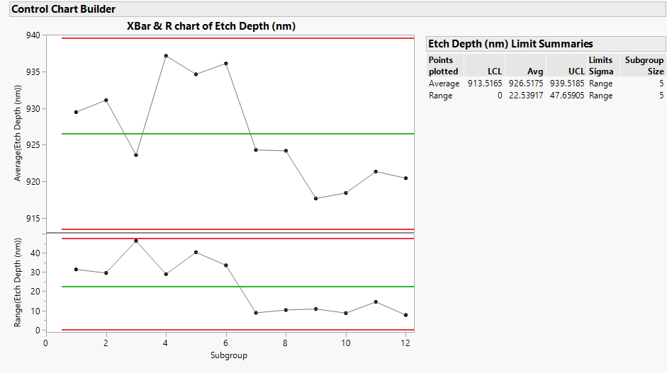
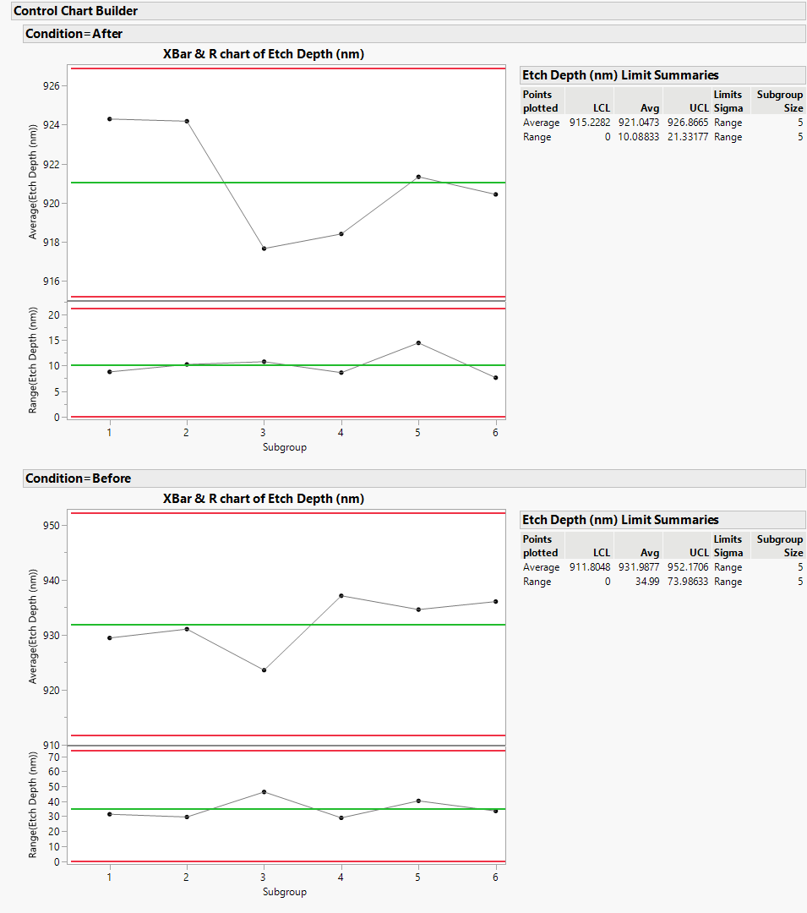
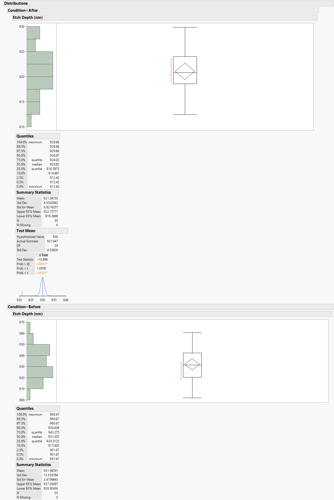
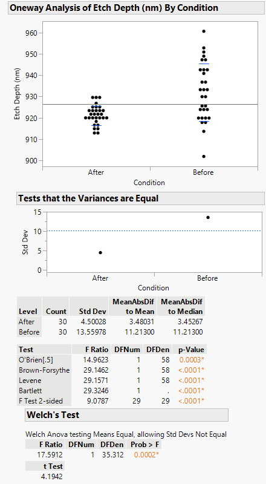
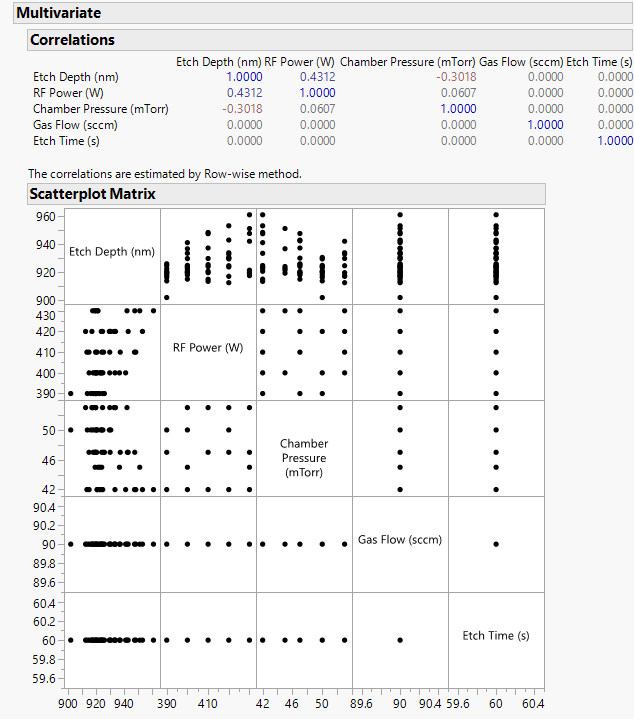

# 📊 Etch Depth DMAIC Optimization

Optimized semiconductor etch process using the Six Sigma DMAIC methodology. Achieved a 72% reduction in etch depth variability through SPC, root cause analysis, and statistical testing using JMP Pro.

---

## 🎯 Objective

- Reduce etch depth variability across wafer samples
- Improve yield and shift the mean closer to the target value of 930 nm
- Identify key process inputs contributing to output variability
- Implement sustainable process control with SPC

---

## 🔍 Methodology: DMAIC Framework

### 1. Define

The etch process was producing inconsistent wafer depths, leading to non-uniform layer thickness and potential yield loss. A DMAIC project was launched to systematically investigate and resolve this issue.

- **CTQ Metric**: Etch Depth (nm)
- **Target**: Mean near 930 nm with reduced variability (σ < 5 nm)
- **Customer Spec Limits**: ±5% of nominal value

---

### 2. Measure

60 wafers were measured — 30 pre-optimization and 30 post-optimization. Process data collected included:

- Etch Depth (nm)
- RF Power (W)
- Chamber Pressure (mTorr)
- Gas Flow (sccm)
- Etch Time (s)

#### 📷 Control Chart – Combined View

The X̄ & R control chart shows a clear shift in process variability at subgroup 7, which marks the start of post-optimization data. The average remains within control limits, while the range sharply reduces, indicating improvement.

---

### 3. Analyze

#### 📷 Control Charts – Before vs. After

The "Before" chart shows high variability with UCL at ~74 and wide dispersion. The "After" chart shows significantly narrower spread and improved stability, indicating process control was achieved.

#### 📷 Distribution Plots

The boxplots and histograms further visualize the improvement. Post-optimization, the distribution is more symmetric and centered, and the standard deviation is considerably lower.

#### 📷 t-Test and Variance Analysis

Statistical validation confirms improvement:
- **Welch’s t-test**: p < 0.0001 → statistically significant mean reduction
- **Levene’s test**: p < 0.0001 → significant variance reduction
- **Standard Deviation** reduced from **13.56 nm** to **4.50 nm**

---

### 4. Improve

#### 📷 Multivariate Correlation and Regression

Multivariate analysis identified:
- **RF Power** positively correlated with Etch Depth (r = +0.43)
- **Chamber Pressure** negatively correlated (r = –0.30)

These two variables were optimized by tightening control windows, which led to a substantial improvement in output consistency.

Additional actions:
- Adjusted setpoints for RF Power and Pressure
- Removed unstable recipes and fine-tuned gas flow settings
- Conducted trial runs to validate changes

---

### 5. Control

To sustain gains:
- Weekly SPC reviews were implemented
- Operators trained on new parameters
- Trigger rules set: if 2+ points exceed ±3σ, root cause analysis is launched
- Standard Operating Procedures (SOPs) were updated

---

## 📈 Results Summary

| Metric               | Before       | After        | % Change         |
|----------------------|--------------|--------------|------------------|
| Mean Etch Depth (nm) | 931.99       | 921.05       | ↓ 10.94 nm       |
| Std Dev (nm)         | 13.56        | 4.50         | ↓ 66.8%          |
| Range (R̄)           | 34.99        | 10.08        | ↓ **71.2%**      |
| Welch’s Test p-value | —            | < 0.0001     | Statistically significant |

---

## 🛠 Tools Used

- **JMP Pro** – Regression, Correlation, Hypothesis Testing
- **X̄ & R Control Charts** – Process monitoring
- **t-Test & Levene’s Test** – Statistical validation
- **DMAIC** – Structured improvement framework

---

## ✅ Outcome

- Achieved a statistically significant and measurable reduction in process variation.
- Improved consistency of wafer etch depth, enhancing downstream process quality.
- Created a robust control plan to ensure sustainable yield improvement.

---

## 📁 Repository Structure
